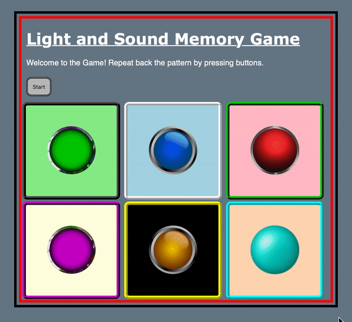

# Pre-work - *Memory Game*

**Memory Game** is a Light & Sound Memory game to apply for CodePath's SITE Program. 

Submitted by: Ishan Patel

Time spent: 4 hours spent in total

Link to project: (https://glitch.com/edit/#!/glittery-fancy-storm)

## Required Functionality

The following **required** functionality is complete:

* [x] Game interface has a heading (h1 tag), a line of body text (p tag), and four buttons that match the demo app
* [x] "Start" button toggles between "Start" and "Stop" when clicked. 
* [x] Game buttons each light up and play a sound when clicked. 
* [x] Computer plays back sequence of clues including sound and visual cue for each button
* [x] Play progresses to the next turn (the user gets the next step in the pattern) after a correct guess. 
* [x] User wins the game after guessing a complete pattern
* [x] User loses the game after an incorrect guess

The following **optional** features are implemented:

* [x] Any HTML page elements (including game buttons) has been styled differently than in the tutorial
* [x] Buttons use a pitch (frequency) other than the ones in the tutorial
* [x] More than 4 functional game buttons
* [x] Playback speeds up on each turn
* [ ] Computer picks a different pattern each time the game is played
* [ ] Player only loses after 3 mistakes (instead of on the first mistake)
* [x] Game button appearance change goes beyond color (e.g. add an image)
* [ ] Game button sound is more complex than a single tone (e.g. an audio file, a chord, a sequence of multiple tones)
* [ ] User has a limited amount of time to enter their guess on each turn

The following **additional** features are implemented:

- [ Created a ridge border around all the game buttons and added a double border around the Start/Stop button. Another style feature I used was the underlined tag for the heading and added a margin to the heading tag, paragraph tag, and the Start/Stop button so that they dont appear to be nearly overlapping with the inner border. Additionally, I added a black outer border and red inner border around the body of the HTML document to change the appearance of the application.] 

## Video Walkthrough (GIF)

If you recorded multiple GIFs for all the implemented features, you can add them here:

## Reflection Questions
1. If you used any outside resources to help complete your submission (websites, books, people, etc) list them here. 
[For the Memory Game project for CodePath Tech Excellence Summer Internship, I was well-equipped with the skills to independently complete the prework project. To create a user-friendly experience, I referenced fg-a.com, a website where I derived the png files that I used for the game buttons.(https://www.fg-a.com/buttons2.htm).]

2. What was a challenge you encountered in creating this submission (be specific)? How did you overcome it? (recommended 200 - 400 words) 
[While developing a javascript code for the Memory Game project, I ran into numerous syntax errors that disabled the game to work properly. In order to resolve this issue, I reviewed the code and found that the incrementing variable, i in the for loop for the PlayClueSequence method, was missing. While reviewing the code, I found  an error in the html file. There was an extra space in the end tag for the stop button, which caused a bit of confusion as to why the button was not popping up on the live server. Furthermore, while trying to style the game to make the game more appealing to the user, I was having an issue with centering some of the heading elements where I tried to use margin-left and margin-right and set both to auto which had no affect so I ended up adding a margin-left to the header so that it wasn’t nearly overlapping with the border around the game. During the implementation of the Memory Game project I realized that we were using the same concepts as the ones taught in my Web Development course at the University of Maryland which helped me overcome some of the confusing bits of the project.]

3. What questions about web development do you have after completing your submission? (recommended 100 - 300 words) 
[Attending a web development course at the University of Maryland College Park I will be able to learn a bit about HTML, CSS, JavaScript, and Node.js throughout the semester yet I would like to learn and explore each of the programming languages and the advantages of each. After completing the pre-work project, I would like to learn more in depth features of javascript and get more experience with HTML, CSS, Javascript, and Node.js. Additionally, I would like to explore/practice more complex web development projects and also get the feel to work as a team on web development projects.]

4. If you had a few more hours to work on this project, what would you spend them doing (for example: refactoring certain functions, adding additional features, etc). Be specific. (recommended 100 - 300 words) 
[If I had a few more hours to devote to this project, I would have made the interface more user friendly by organizing the buttons into a table for a user to control which button is selected with the up,down,left, and right keys on the keyboard by finding additional resources online. Using online resources, another great feature I would like to implement is a timer for each turn and give the user 3 tries before the game is over. Furthermore, I would also seek to add a randomization feature that arbitrarily selects a pattern so that each time a user engages with the game, they are met with a unique sequence. By randomizing the sequence, the game prevents the user from memorizing the same pattern each time the game is played.]

## Interview Recording URL Link

[My 5-minute Interview Recording](your-link-here)

## License

    Copyright [Ishan Patel]

    Licensed under the Apache License, Version 2.0 (the "License");
    you may not use this file except in compliance with the License.
    You may obtain a copy of the License at

        http://www.apache.org/licenses/LICENSE-2.0

    Unless required by applicable law or agreed to in writing, software
    distributed under the License is distributed on an "AS IS" BASIS,
    WITHOUT WARRANTIES OR CONDITIONS OF ANY KIND, either express or implied.
    See the License for the specific language governing permissions and
    limitations under the License.
